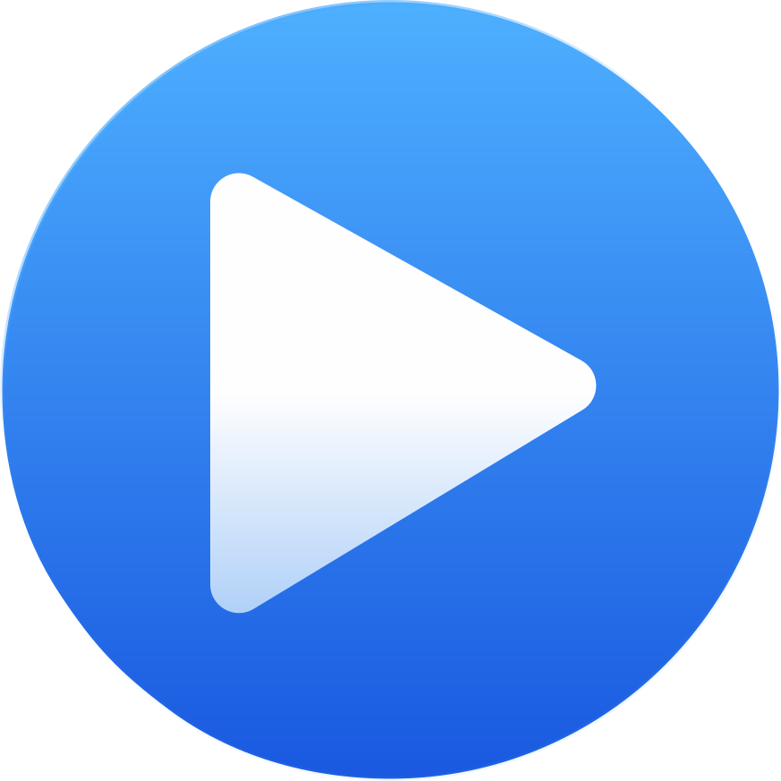

<p align="center">
  
</p>

<h1 align="center">Goosic</h1>

<p align="center">
  A fast, responsive YouTube Music desktop client for Windows, macOS, and Linux.
</p>

<p align="center">
  <a href="LICENSE"></a>
  <a href="https://deepwiki.com/AnalogicGoose/Goosic"></a>
</p>

<p align="center">
  <a href="https://github.com/AnalogicGoose/Goosic/releases/latest">
    
  </a>
</p>

Built as a reaction to the sluggish webview-wrapper experience — Goosic talks to YouTube's InnerTube API directly, renders its own UI, and caches aggressively, so navigation and playback feel instant.


## Features

- **Fast and responsive UI** — instant navigation with prefetch and aggressive caching; no page reloads, no spinners on every click
- **Flexible player layouts** — dock the player at the bottom or as a right-side panel
- **Floating player widget** — pop the player out into a compact always-on-top window
- **Synced lyrics** — line-by-line synced lyrics from multiple providers (LRCLIB, Musixmatch, Genius)
- **Hi-res cover art** — upgrades album covers to high-resolution studio art when available
- **Full library support** — your playlists, likes, albums and artists; search with filters; radio/autoplay queues
- **Windows integration** — media keys, System Media Transport Controls, tray icon, single instance
- **Linux integration** — media keys via MPRIS, tray icon (needs an AppIndicator/KStatusNotifierItem extension on vanilla GNOME — see FAQ), autostart, single instance
- **Auto-updates** — the app updates itself from GitHub Releases, and keeps its yt-dlp copy fresh automatically

> **Disclaimer:** Goosic is an unofficial client. It is not affiliated with,
> endorsed by, or sponsored by Google or YouTube. "YouTube" and "YouTube Music"
> are trademarks of Google LLC. The app streams audio through
> [yt-dlp](https://github.com/yt-dlp/yt-dlp) and may stop working at any time if
> YouTube changes its internals. Use at your own risk.

## Install

Download the latest package from the [Releases](https://github.com/AnalogicGoose/Goosic/releases) page and run it.

- **Windows**: `.exe` installer (NSIS), Windows 10/11.
- **macOS**: universal `.dmg` for Apple Silicon and Intel. The current build is
  ad-hoc signed, so macOS may require a Gatekeeper override on first launch.
- **Linux**: `.AppImage` (no install step, just `chmod +x` and run), `.deb`
  (Debian/Ubuntu), or `.rpm` (Fedora/openSUSE). Only the AppImage build
  auto-updates itself; the `.deb`/`.rpm` packages need a manual re-download.
- On first launch the app downloads its own copy of yt-dlp (~18 MB) and the
  official Deno runtime archive (~50 MB) into its data folder. Deno is needed
  by current yt-dlp releases to solve YouTube's JavaScript challenges. Both
  downloads come directly from their official GitHub Releases; yt-dlp checks
  every 72 hours and Deno refreshes at most every 90 days.
- Browsing and search work signed out. Playback, library access, likes, and
  playlists require signing in with an active YouTube Music/YouTube Premium
  account.

### FAQ

**Windows says "Windows protected your PC" (SmartScreen).**
The installer is not code-signed (certificates are expensive for a free
open-source project). Click "More info" → "Run anyway". The source code is
public — you can audit it or build it yourself.

**My antivirus flags the app / yt-dlp / Deno.**
yt-dlp is a widely-used open-source downloader that some AV vendors
false-positive on. The binary is downloaded directly from yt-dlp's official
GitHub releases. Deno is an MIT-licensed JavaScript runtime downloaded from
the official `denoland/deno` GitHub releases.

**Will Google ban my account for using this?**
Browsing/search/library requests look identical to the official web app. The
app checks the signed-in account's Premium status before playback, but never
passes account cookies to yt-dlp; stream extraction itself stays anonymous.
There are no known cases of accounts being banned for third-party players —
but no guarantees; see the disclaimer above.

**Playback suddenly stopped working.**
YouTube periodically changes its streaming internals. yt-dlp usually ships a
fix within days, and the app picks it up automatically (it self-updates its
yt-dlp copy every ~3 days). Restarting the app forces the check.

**The AppImage won't run / complains about FUSE.**
Some distros no longer ship `libfuse2` by default, which older AppImages need
to mount themselves. Either install `libfuse2` (or `fuse`) from your distro's
package manager, or run the AppImage with `--appimage-extract-and-run`.

**No tray icon shows up on GNOME.**
Vanilla GNOME Shell doesn't show any application tray icons without an
AppIndicator/KStatusNotifierItem extension installed (this isn't
Goosic-specific — it affects every app that uses a tray icon on GNOME).

## Stack

- **Shell:** Tauri 2 (Rust backend, system webview — WebView2 on Windows,
  WebKitGTK on Linux)
- **Frontend:** React 19 + TypeScript
- **Build:** Vite 7
- **Styling:** Tailwind CSS v4
- **Components:** shadcn/ui (new-york style, neutral base, YouTube red accent)
- **Routing:** TanStack Router (file-based, type-safe, prefetch on intent)
- **Data:** TanStack Query
- **Client state:** Zustand
- **Icons:** lucide-react

## Dev

```bash
pnpm install
pnpm tauri dev
```

Frontend-only dev (no Tauri window): `pnpm dev`.

## Quality checks

```bash
pnpm test         # vitest unit tests (pure parsers/matchers)
pnpm lint         # eslint
pnpm format       # prettier --write
pnpm build        # tsc + vite production build
```

CI (`.github/workflows/ci.yml`) runs typecheck, lint, tests, build and
`cargo check` on every push / PR.

## Project layout

```
src/
├── routes/              # TanStack Router file-based routes
├── components/
│   ├── ui/              # shadcn primitives
│   ├── layout/          # AppShell, sidebar, topbar, player bar, floating player, lyrics
│   └── shared/          # Track list/rows, cards, shelves, context menus
├── lib/
│   ├── innertube/        # Raw InnerTube client + parsers
│   ├── lyrics/          # LRCLIB / Musixmatch / Genius sources + LRC parser
│   ├── store/           # Zustand stores
│   ├── audio-engine.ts  # Playback engine
│   ├── stream.ts        # Stream URL resolver (localhost proxy)
│   └── utils.ts         # cn() and friends
└── hooks/
src-tauri/               # Rust backend (axum stream proxy, cookies, tray)
```

## Credits

- [yt-dlp](https://github.com/yt-dlp/yt-dlp) — audio streaming
- [Deno](https://github.com/denoland/deno) — MIT-licensed YouTube challenge runtime
- [LRCLIB](https://lrclib.net) — synced lyrics
- Musixmatch and Genius — lyrics sources
- [Tauri](https://tauri.app), [shadcn/ui](https://ui.shadcn.com),
  [TanStack](https://tanstack.com), and the rest of the stack above

## License

[GPL-3.0](LICENSE) — free to use, modify, and redistribute; derivative works
must stay open source under the same license.
